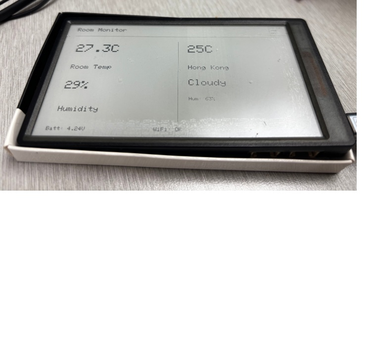

# M5Paper Weather Monitor

A complete embedded weather monitoring application for the M5Stack M5Paper e-ink device that displays room temperature/humidity and Hong Kong weather with WiFi configuration via touch interface.

## Working Demo



**Features:**
- Room temperature & humidity from built-in SHT30 sensor
- Hong Kong weather from wttr.in API (updates every 10 minutes)
- WiFi configuration via touch-based QWERTY keyboard
- Persistent WiFi settings in SPIFFS
- Split-screen display layout
- Real-time weather fetching after setup cancellation
- Serial debug output monitoring

## Hardware

- **Device**: M5Stack M5Paper (original, ESP32-D0WDQ6)
- **Display**: 4.7" e-ink 960×540 (IT8951 controller)
- **Sensor**: Built-in SHT30 (temperature & humidity)
- **Specs**: 16MB flash, 8MB PSRAM, USB-C

## Display

Updates every 60 seconds with a split-screen layout:

**Left Side (Room Data):**
- Room temperature (°C) from built-in SHT30 sensor
- Room humidity percentage
- Labeled clearly

**Right Side (Hong Kong Weather):**
- Hong Kong current temperature (°C)
- Weather condition (Sunny, Cloudy, Rainy, etc.)
- Hong Kong humidity percentage
- Fetched via OpenWeatherMap API every 10 minutes

**Footer:**
- Battery voltage
- WiFi connection status (OK / Offline)
- Landscape orientation (USB port on left)

## Setup

### Prerequisites

- Python 3.7+
- PlatformIO CLI
- OpenWeatherMap API Key (free at https://openweathermap.org/api)

### Installation

1. **Install PlatformIO CLI** (if not already installed):
   ```bash
   python -m pip install --user platformio
   ```

2. **Add PlatformIO to PATH** (Windows):
   - Add `C:\Users\<USERNAME>\AppData\Roaming\Python\Python312\Scripts` to your system PATH
   - Or prepend to commands: `python -m pio ...`

3. **Connect M5Paper** via USB-C to your computer

4. **Get OpenWeatherMap API Key**:
   - Visit https://openweathermap.org/api
   - Sign up for free account
   - Generate API key (free tier allows ~60 calls/min)
   - Keep this key for setup

## Building & Flashing

### 1. Verify Build (No Upload)
```bash
pio run
```
Compiles the firmware without uploading. Use this to catch compilation errors.

### 2. Identify Serial Port
Check which COM port your device is on:
- **Windows**: Device Manager → Ports (COM & LPT) → Look for "USB" or "CH9102"
- **Linux/Mac**: `ls /dev/ttyUSB*` or `ls /dev/tty.usbserial*`

### 3. Flash to Device
Replace `COM3` with your actual port:
```bash
pio run --target upload --upload-port COM3
```

On success, the device will reboot and start running the app.

### 4. Monitor Serial Output
View debug/sensor output in real-time:
```bash
pio device monitor -b 115200 --port COM3
```

Example output:
```
Room: 29.8°C, 34% | HK: 28.5°C, Cloudy
```

Press `Ctrl+C` to exit the monitor.

## WiFi Setup (First Run)

When the app boots for the first time, it will display:
```
Hold RESET button for 3 seconds to enter WiFi setup...
```

### Setup Steps:

1. **Hold RESET button** for 3 seconds while the device is starting
2. Device enters setup mode and displays a **touch keyboard**
3. **Enter WiFi SSID** (network name):
   - Tap letters on the on-screen keyboard
   - Tap CLEAR to erase mistakes
   - Tap DONE to confirm
4. **Enter WiFi Password**:
   - Repeat the process (displayed as asterisks for privacy)
5. **Enter OpenWeatherMap API Key**:
   - Use the key from https://openweathermap.org/api
   - Tap DONE when complete
6. Device saves config and **reboots**

### After Setup:

- WiFi credentials are saved in device storage (SPIFFS)
- Device connects to WiFi automatically on boot
- Weather updates every 10 minutes
- Config persists until explicitly reconfigured

### Re-enter Setup:

To change WiFi or API key, simply hold RESET during boot again.

## Project Structure

```
.
├── platformio.ini       # PlatformIO project config (board, libraries, build settings)
├── src/
│   └── main.cpp        # Firmware source code
├── CLAUDE.md           # Development notes
├── README.md           # This file
└── .gitignore          # Git ignore patterns
```

## Libraries

Auto-downloaded by PlatformIO:
- **M5EPD** v0.1.5+ — M5Paper display and sensor drivers

No manual library installation needed; PlatformIO fetches everything from `lib_deps` in `platformio.ini`.

## Notes

- **Display updates**: Every 60 seconds (UPDATE_MODE_GC16 for high-quality refresh)
- **E-ink rule**: Avoid refreshing more than ~1x/sec to minimize flicker and wear
- **Rotation**: Set to 0 (landscape, USB on left); change to 90 for portrait in `src/main.cpp`

## Troubleshooting

| Issue | Solution |
|-------|----------|
| `pio: command not found` | Add PlatformIO scripts folder to PATH or use `python -m pio` |
| Port not found | Check Device Manager or `ls /dev/tty*`; try different USB cable |
| Upload fails | Hold reset button on device during upload, or check baud rate (should be 115200) |
| No sensor readings | Verify SHT30 is enabled in M5.begin() call |
| WiFi shows "Offline" | Check SSID/password in setup; re-run setup to update credentials |
| Weather shows "Loading..." | Weather fetches every 10 minutes from wttr.in |
| Touch not responding | See **Touch Debugging** below |

## Touch Debugging

If the touchscreen isn't responding, use the included touch debug sketch:

### Steps:

1. Copy touch debug sketch:
   ```bash
   cp src/touch_debug.cpp.bak src/touch_debug.cpp
   cp src/main.cpp src/main.cpp.backup
   cp src/touch_debug.cpp src/main.cpp
   ```

2. Compile and upload:
   ```bash
   pio run --target upload --upload-port COM3
   ```

3. Open serial monitor:
   ```bash
   pio device monitor -b 115200 --port COM3
   ```

4. **Tap the screen** and watch for:
   - `Touch detected: x=?, y=?` in serial output
   - Coordinates displayed on screen

5. **Troubleshoot** based on output:
   - No output = touch hardware not detected
   - Coordinates always 0 = coordinate reading issue
   - Wrong coordinates = coordinate scaling/rotation issue

6. When done debugging, restore the app:
   ```bash
   cp src/main.cpp.backup src/main.cpp
   pio run --target upload --upload-port COM3
   ```

### Known Issues:

- M5Paper GT911 touch controller may need calibration
- Coordinate system may be rotated/scaled differently
- Touch may not work in all M5Paper variants (original vs newer versions)

## Serial Port Reference

Common USB-to-serial chips on M5Paper boards:
- **CH340G** / **CH9102** → Windows Device Manager shows as "COM#"
- Baud rate: **115200**
